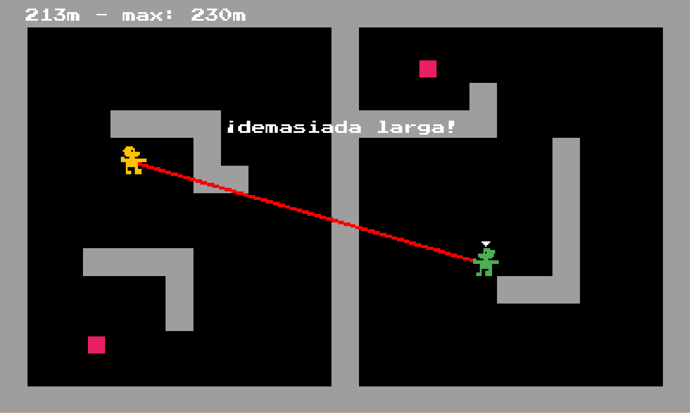

# La Soga

Videojuego de puzzles hecho con Phaser. Juégalo en <https://joaquin30.itch.io/la-soga>.

## Como jugar

Ejecuta un servidor HTTP en la carpeta y navega a `index.html`. Por ejemplo, si tienes Python 3, ejecuta `python -m http.server`.

